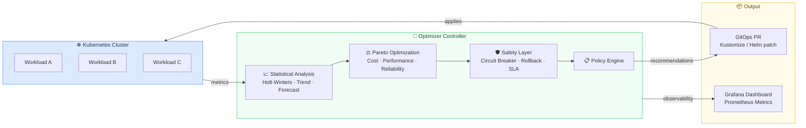

# k8s-resource-optimizer

> **Most Kubernetes clusters waste 50–70% of their resources — or crash under load because they're under-provisioned.**
> Existing autoscalers react to single metrics. They don't forecast, don't optimize across trade-offs, and don't protect against unsafe changes.
> We built something different.

---

## What Makes This Different

| Existing tools | This project |
|---|---|
| React to current metrics | **Forecast** future demand (Holt-Winters, trend decomposition) |
| Optimize for one objective | **Pareto-optimal** recommendations — cost vs. performance vs. reliability |
| No safety guarantees | **Circuit breakers, SLA monitoring, automatic rollback** built in |
| Suggest or scale | **Generate GitOps PRs** — auditable, reviewable, automated |

---

## How It Works

---

## Stack

`Go` · `Kubernetes controller-runtime` · `Prometheus` · `Grafana` · `Kustomize` · `Helm` · `kind`

---

## Repositories

| | |
|---|---|
| [`intelligent-cluster-optimizer`](https://github.com/k8s-resource-optimizer/intelligent-cluster-optimizer) | Controller, optimizer engine, safety layer, GitOps integration, monitoring |
| [`optimizer-test`](https://github.com/k8s-resource-optimizer/optimizer-test) | 600+ unit, integration, and E2E tests |

---

**[Azra Karakaya](https://github.com/azrakarakaya1) · [Erva Şengül](https://github.com/ervasengul)**
Istanbul Medipol University · Computer Engineering · 2024–2025
